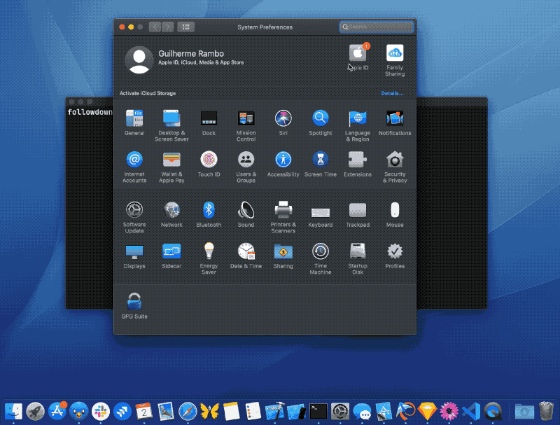

# FollowDown

Clean up annoying badges in System Preferences.

**WARNING: This tool was made in a hurry to fix an issue on my Mac. It messes with the Dock preferences property list, so I strongly recommend making a backup before running it, just in case. I'm not proud of this code, don't use it as a reference. This was only tested on macOS 10.15.4 on a system with SIP disabled, I have no idea how it behaves in other environments. Feel free to send PRs for fixing any issues you encounter.**

If you're stuck with a badge in your Apple ID preference pane (or any other type of badge on macOS), this will likely be useful for you. This command-line tool will delete the CoreFollowUp database (hence its name), remove badges from System Preferences panes and the app itself in the Dock, and restart the appropriate daemons.

## Building

Run `swift build`.
